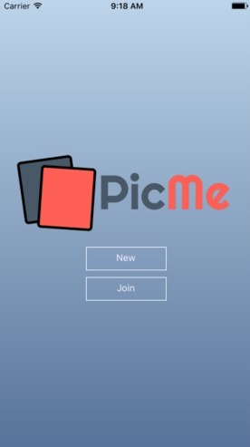

# PicMe

An app for users to create events and upload photos to those events to be compared to one another. Other users can then join their event to see the entries and vote on their favourite. When time's up, the results are calculated and a winner is revealed!

Created at ConUHacks 2017

# How it was built

Using React Native for the front end, to target both Android and iOS. Additionally, it allowed one of our team members to explore a technology he was unfamiliar with and learn many new things.

The back end was built with Node and Express, another technology new to one of our team members, but not the other. They worked together to build all the endpoints required for the front end to function, and hooked them into our mongodb server.

# Screenshots

|    Welcome    |     Events      |
|:-------------:|:---------------:|
|  |  |

| Event Details |   Votes    |
|:-------------:|:----------:|
|  |  |
